# SansCue: MVP Build Plan

We'll build the conference flow in steps. This is the initial scope, not every planned feature.

**Recommended stack:** Preact + TypeScript + Vite + CSS; Rust + Axum + Tokio; PostgreSQL + SQLx; Docker Compose on EC2 with Caddy HTTPS.

## Services

| Service | Owns |
|---|---|
| Sessions-and-feedback | Rooms, access, published questions, responses, and live updates |
| Bee-connection | Original transcript events and their room association |
| Topics-and-questions | Topic context, generation jobs, and generated questions with evidence references |

Each backend runs independently and owns its database. Services exchange data through authenticated APIs or messages, never by reading another service's database. The web app is the frontend.

Diagrams use short service names and show the main data flow through the components built so far. AWS hosting from Step 1 applies throughout.

## Step 1: Deploy the platform

**Build:**

1. Browser interface — **Preact + TypeScript + Vite + CSS**.
2. Backend and database — **Rust + Axum + Tokio, PostgreSQL + SQLx**. Keep numbered SQL changes for database setup and updates.
3. HTTPS deployment and server/database health checks — **EC2 + Docker Compose + Caddy**. Document configuration, persistent storage, backup, and restore.

**Service:** Sessions-and-feedback microservice and frontend setup.

**Success:** HTTPS page loads; backend and database checks pass.

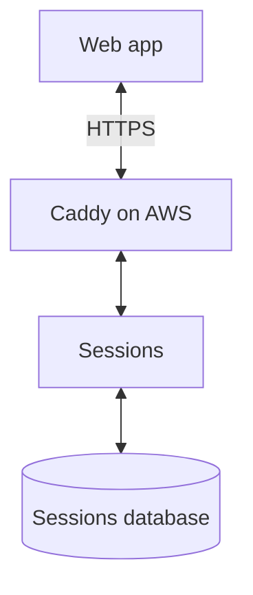

## Step 2: Create and join rooms

**Build:**

1. Create rooms and unique join links — **Axum + PostgreSQL**.
2. Display join links as QR codes — **qrcode**, loaded on the host screen.
3. Join rooms, save membership, and return current room state — **browser fetch + Axum + SQLx**.

**Service:** Sessions-and-feedback.

**Success:** Rooms persist; valid QR links join the correct room; invalid links return clear errors.

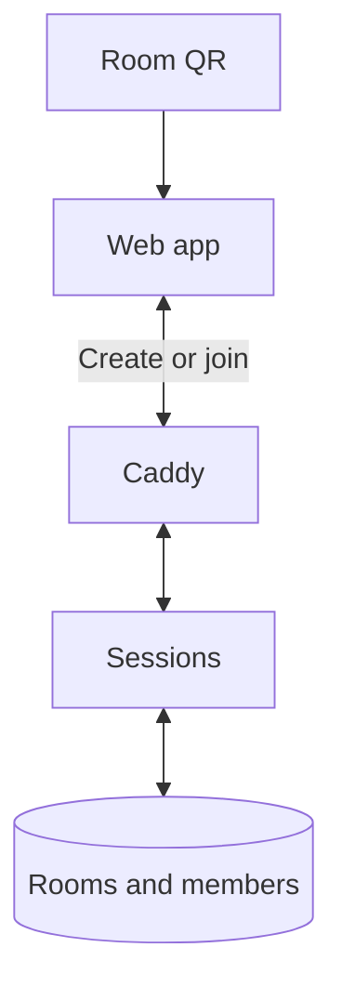

## Step 3: Control room access

**Build:**

1. Define speaker setup and TA invitations; issue and revoke access — **Axum + PostgreSQL**.
2. Remember room membership and permissions — **Secure HttpOnly session cookies** backed by database records.
3. Check room and role on protected requests; add origin and CSRF checks — **Axum**. Apply the same access rules to WebSockets in Step 5.

**Service:** Sessions-and-feedback.

**Success:** Protected actions require permission; changing a URL cannot grant another role's access.

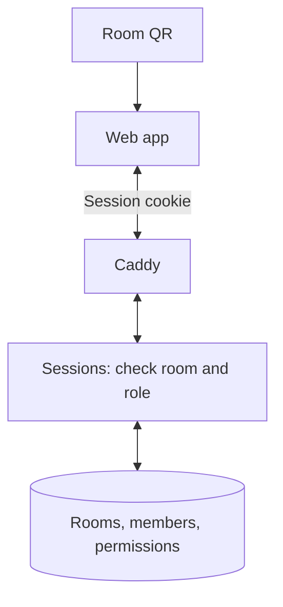

## Step 4: Build room tabs

**Build:**

1. Speaker dashboard, Questions view, and TA access to Questions — **Preact + CSS**.
2. Separate audience response and written Q&A tabs — **Preact**. Written-question entry belongs only in Q&A.
3. Navigation, room-status screens, and retained input when switching tabs — **browser History API + Preact state**.

**Service:** Frontend, using sessions-and-feedback.

**Success:** Tabs respect permissions and preserve unfinished input.

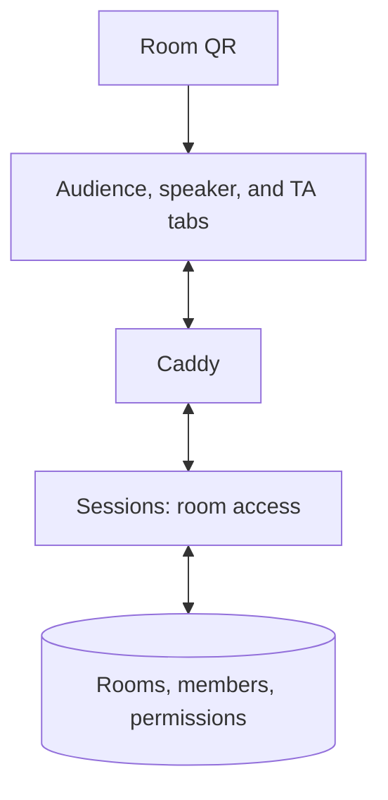

## Step 5: Send live updates

**Build:**

1. Browser connections grouped by room and permission — **Axum WebSockets + browser WebSocket API**.
2. Save changes before acknowledgement and broadcast; prevent repeated actions on retries — **SQLx transactions + request IDs**.
3. Define JSON events and limit outgoing queues for slow clients — **Serde + Tokio**. Record send/receive timings.

**Service:** Sessions-and-feedback.

**Success:** Updates reach permitted tabs without refresh; retries do not repeat saved actions.

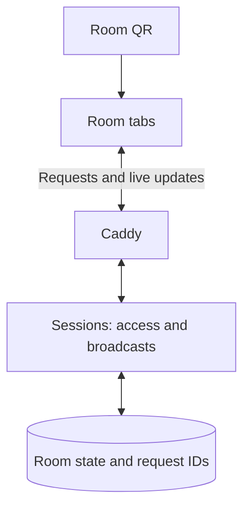

## Step 6: Reconnect and end rooms

**Build:**

1. Retry lost connections and restore membership — **browser WebSocket API + session cookies**.
2. Reload saved room state after reconnecting without missing changes during recovery — **Axum + SQLx + event ordering**.
3. End rooms, notify connected tabs, and reject further participation — **Axum + PostgreSQL + WebSockets**.

**Service:** Sessions-and-feedback.

**Success:** Reconnecting restores current state without duplicate membership; ended rooms reject participation.

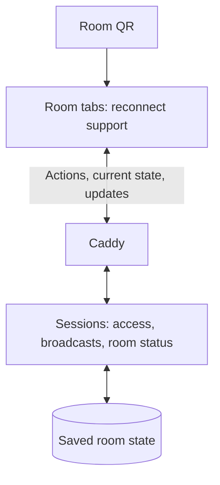

## Step 7: Connect Bee

**Build:**

1. Receive Bee transcript events and associate the conversation with a room — **Bee stream + Rust adapter**.
2. Preserve raw events, receive times, and arrival order — **PostgreSQL + SQLx**. Verify available source IDs and ordering information.
3. Handle reconnects and record gaps; verify how missed context can be recovered. Keep recorded events for repeatable integration tests.

**Service:** New Bee-connection microservice.

**Implemented development boundary:** A canonical event/replay pipeline, Bee-owned
storage, room binding commands, and outbox delivery are implemented independently
of physical hardware. The checked-in synthetic fixture exercises ordering,
duplicate handling, reconnect/gap evidence, and malformed observations.

**Still unverified:** **REAL BEE DEVICE / LIVE API VERIFICATION** is an external
gate. No live transport, device authentication, real source identity/order, or
real recovery behavior is claimed. Synthetic fixture success does not satisfy
live Bee acceptance.

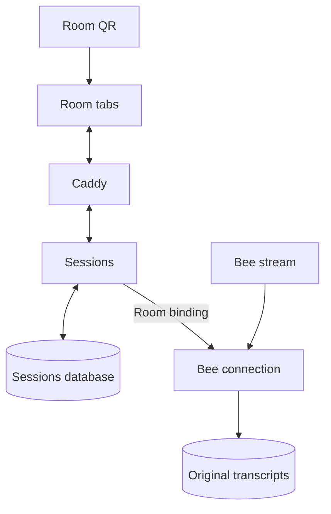

## Step 8: Generate a question

**Build:**

1. Decide an initial question format and topic-precision behavior when starting this step.
2. Process saved transcript jobs separately from audience requests — **Rust + PostgreSQL**, with retry IDs and authenticated service delivery.
3. Send recent passages and relevant earlier session context to a provisional model. Store the question, evidence references, model/prompt version, and generation time.
4. Display a generated candidate in a development preview — **Preact**. Keep publication and question frequency separate from topic precision.

**Service:** New topics-and-questions microservice; preview through sessions-and-feedback.

**Success:** A short question has traceable transcript evidence; slow generation leaves room updates responsive.

**Current boundary:** The deterministic `stub-v1` preview is unpublished and
staff-only; it is not a model result or Step 8 quality acceptance. A local
synthetic replay acceptance procedure is documented in
[`services/acceptance`](../services/acceptance/README.md). It requires three
isolated PostgreSQL databases and must be run explicitly. Model quality, live
Bee behavior, and Docker startup are separate unverified gates.

**Current development slice:** The device-independent accepted-event outbox is
connected to a new Topics-and-questions-owned transcript projection, idempotent
job, and candidate outbox. For development only, `stub-v1` generates exactly
one deterministic, unpublished preview per accepted event. Sessions checks the
active conversation and bound speaker session before storing the candidate;
only speaker/TA snapshots expose it. No model/provider is called, no candidate
can be published or shown to the audience, and this slice is not Step 8
acceptance. See the service contract and README; live Bee and Docker validation
remain separate.

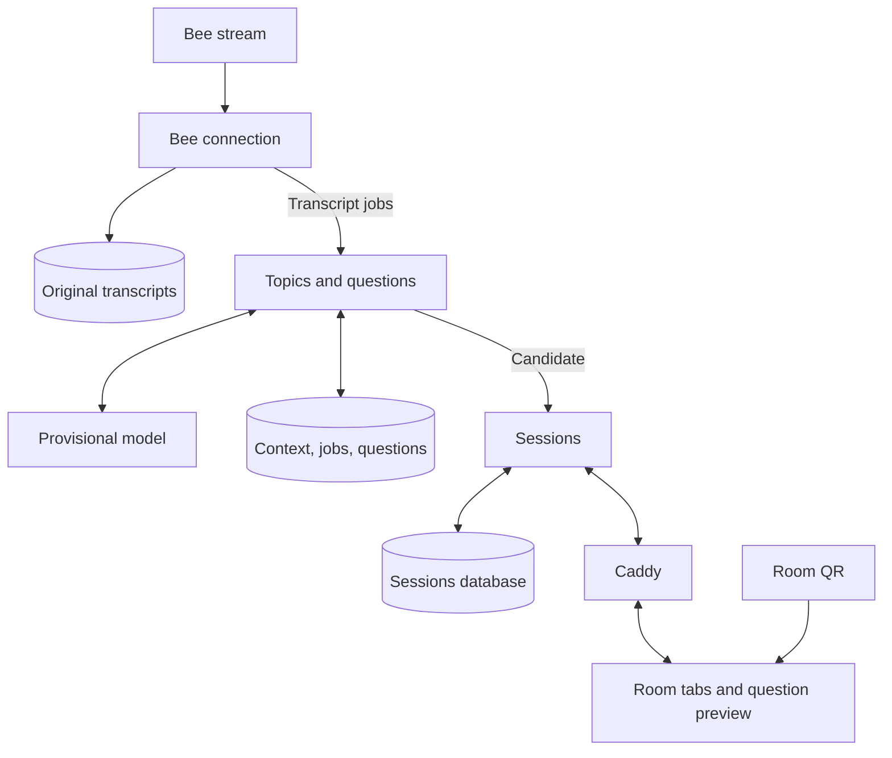

## Step 9: Choose the model

**Build:**

1. Set question-quality, generation-delay, and cost targets.
2. Compare two candidates using the same Bee excerpts and instructions.
3. Choose the model and record its exact ID, prompt, settings, and results. **Bedrock is a hosting candidate; provider and model remain undecided until evaluation.**

**Service:** Evaluation within topics-and-questions; no new microservice.

**Success:** A model is selected against recorded results; if neither meets the targets, revise and repeat.

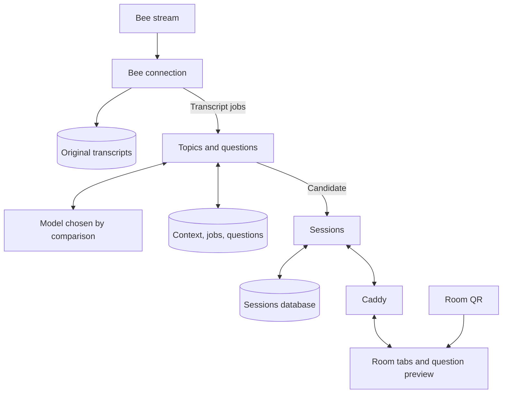

## Step 10: Collect responses and update the dashboard

**Build:**

1. Decide response controls, publication rules, written-Q&A behavior, and dashboard measures when starting this step.
2. Publish fixed question versions; retain evidence references and prevent late results from replacing an active question — **Axum + PostgreSQL**.
3. Save responses and context-linked written questions; send ratings and response counts to the dashboard — **SQLx + WebSockets + Preact**. Respect the chosen question type.

**Service:** Sessions-and-feedback and frontend; topics-and-questions supplies generated candidates.

**Success:** Published questions stay stable; saved responses produce correct counts and live dashboard updates.

**Current implementation:** Speaker publication copies evidence into an
immutable question version; audience responses are idempotent and aggregate
counts/percentages are returned only to staff. Written Q&A is separate from
ratings and private to the audience author plus speaker/TAs. The frontend shows
counts and one-decimal percentages (an em dash for null percentages when there
are no respondents). This minimal flow does not establish load/performance.

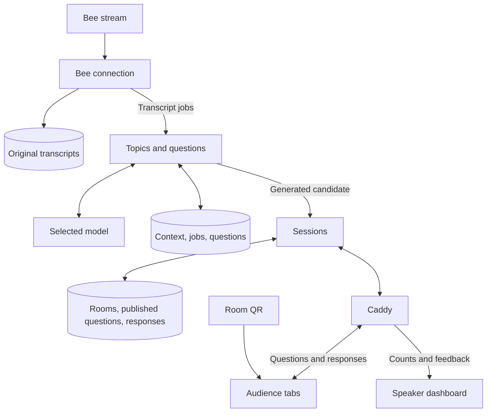

## Step 11: Check correctness and performance

**Build:**

1. Verify retries, duplicate/out-of-order events, disconnects, access checks, question stability, and response totals across services.
2. Agree on concurrent rooms, attendees, acceptable delays, and cost. Measure the full flow with actual Bee data, including median and 95th-percentile delays, errors, CPU, and memory.
3. Improve measured bottlenecks and retest. Choose server capacity from results; add replicas only with shared event delivery between them.

**Service:** All three microservices and frontend. Each step also gets its own checks during development.

**Hardware-independent acceptance procedure:**
[`services/acceptance/synthetic-mvp.py`](../services/acceptance/README.md) starts
the three local Rust services and Bee worker, replays the deterministic fixture,
then checks candidate idempotency, staff-only evidence, publication, audience
rating/Q&A, counts, and audience privacy using three distinct PostgreSQL DB URLs.
It requires neither Docker nor device/model/AWS access. This synthetic flow and
the service PostgreSQL suites have passed against the source tree integrated as
`dev` commit `3ce885b`; see [environment verification](environment-verification.md)
for exact scope. Live Bee, model quality, Docker/Compose, AWS, performance, and
backup/restore remain independent acceptance gates.

**Success:** The agreed workload meets correctness, delay, and cost targets.

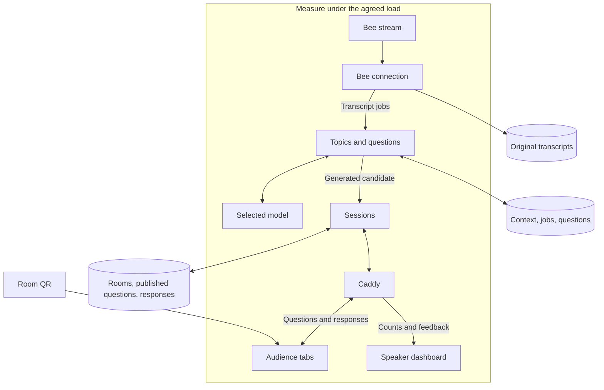

## Decisions for the relevant step

- **Before Step 7:** Bee event identity, ordering, gap recovery, and service delivery transport.
- **Before Step 8:** Question type, topic boundaries, precision, and context selection. Keep earlier context within the session; participant history across sessions is deferred.
- **Before Step 9:** Quality, delay, and cost targets for model comparison.
- **Before Step 10:** Response choices, publishing, frequency, timers, Q&A visibility/moderation, dashboard attention, and TA permissions.
- **Before Step 11:** Expected room sizes, simultaneous rooms, and performance targets.
